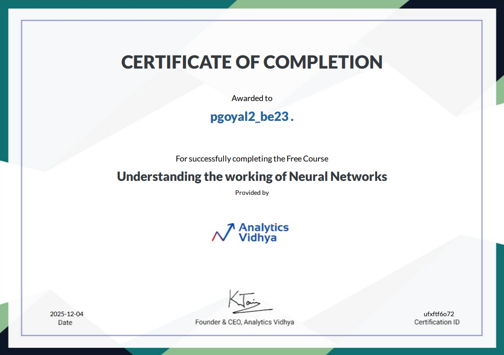

# 🧠 Neural Networks Certification Journey

## Certificate

Here's my official completion certificate:

*Note: You can download and view the full certificate PDF by clicking the link above.*

---

## About This Certification

This folder contains my completion certificate for the **"Understand Neural Networks"** certification course. This was an incredible learning experience that deepened my understanding of how artificial neural networks work and their real-world applications.

## What I Learned

Throughout this course, I gained comprehensive knowledge about:

### Core Concepts
- **Neural Network Fundamentals** - Understanding how neurons work in artificial intelligence
- **Architecture Design** - Learning about different types of neural network structures
- **Forward Propagation** - How data flows through the network layers
- **Backpropagation** - The learning process that allows networks to improve
- **Activation Functions** - The mathematical functions that make neural networks powerful

### Practical Applications
- **Image Recognition** - How neural networks can identify and classify images
- **Natural Language Processing** - Understanding text and human language
- **Pattern Recognition** - Identifying complex patterns in data
- **Predictive Modeling** - Using neural networks to make predictions

### Advanced Topics
- **Deep Learning Fundamentals** - Multi-layer neural networks and their capabilities
- **Optimization Techniques** - Methods to improve network performance
- **Overfitting and Regularization** - Preventing models from memorizing data
- **Real-world Implementation** - Practical considerations for deploying neural networks

## Course Highlights

What made this certification particularly valuable:

- **Hands-on Examples** - Practical exercises that reinforced theoretical concepts
- **Industry Applications** - Real-world use cases from various industries
- **Best Practices** - Learning from experts about effective neural network design
- **Mathematical Foundation** - Understanding the math behind the magic
- **Problem-Solving Approach** - How to approach complex AI problems systematically

## Key Takeaways

This course transformed my understanding of artificial intelligence. I learned that neural networks aren't just complex algorithms - they're powerful tools that can solve real problems when properly designed and implemented. The most valuable insight was understanding how to think about AI problems from both a technical and practical perspective.

The certification reinforced the importance of:
- **Solid mathematical foundation** for understanding how neural networks learn
- **Practical experimentation** to see how theory translates to real results
- **Ethical considerations** in AI development and deployment
- **Continuous learning** as the field rapidly evolves

## Personal Reflection

Completing this certification was more than just earning a credential - it was about building a strong foundation in one of the most important technologies of our time. Neural networks are everywhere around us, from the recommendation systems we use daily to the medical diagnosis tools that save lives.

This knowledge directly applies to my current projects in the UML501P course, where I'm implementing various AI models using platforms like Teachable Machine and Landing AI. Understanding the underlying neural network principles helps me make better decisions about model architecture, training approaches, and deployment strategies.

## Next Steps

Armed with this foundational knowledge, I'm excited to:
- Apply neural network concepts to more complex projects
- Explore specialized architectures like CNNs and RNNs
- Dive deeper into deep learning frameworks
- Work on real-world AI applications that can make a positive impact

---

**Certificate Holder:** Priyanshi  
**Roll Number:** 102497022  
**Course:** 2027, COPC, CSED  
**Contact:** pgoyal2_be23@thapar.edu

*This certification represents my commitment to understanding and responsibly applying artificial intelligence technologies.*